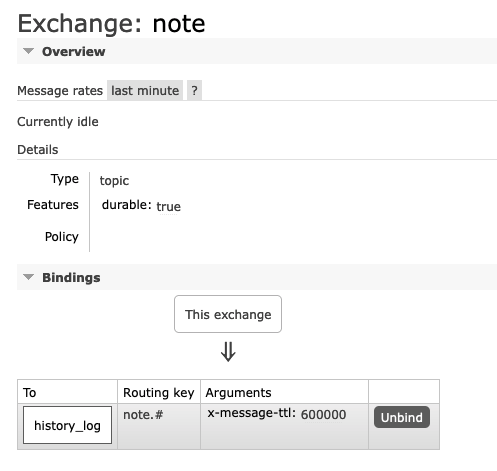

# Note-API
## Requirement
- Server rabbitmq
    -  Config topic: exchange , queue and binding key

        
    - set ENV file:
    ```zsh
        RABBIT_USER=admin
        RABBIT_PASSWD=passwd
        RABBIT_HOST=rabbit-service.abc.com
        RABBIT_PORT=12345
        RABBIT_QUEUE=history_log
        RABBIT_CONSUMERNAME=vanhc_consumer
        RABBIT_EXCHANGE=note
        RABBIT_ROUTINGKEY=note.vanhc
    ```

## Deploy step:
- Deploy consumer:
    ```zsh
        $ cd $PROJ/consumer
        $ go run consumer
    ```
- Deploy service note API
    ```zsh
        $ cd $PROJ
        $ go run github.com/hcongvan/Note-API
    ```
